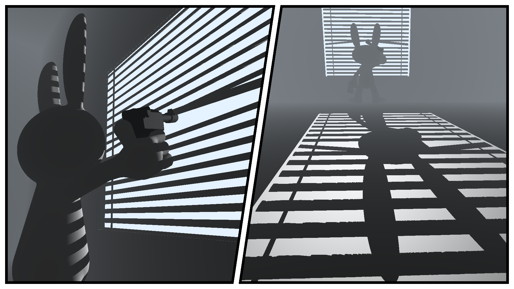

# Lagomorph Noir executable graphic

Raymarched image written in GLSL and C for Ubuntu. This was my entry in the 4k executable graphics compo for the [Revision 2021](https://2021.revision-party.net/start) demoparty.

Tools used:

* [Clang](https://clang.llvm.org/) compiler
* Libraries: OpenGL and GTK 3
* [Shader Minifier](https://github.com/laurentlb/Shader_Minifier)
* sstrip from [ELFKickers](https://github.com/BR903/ELFkickers)
* [xz](https://tukaani.org/xz/) (and shell scripting) for executable compression
